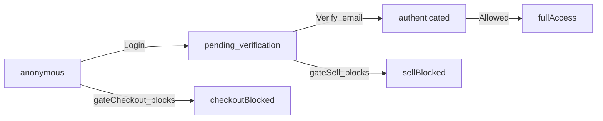

# Plan Maestro (Cursor-ready) + Backlog + 4 Sprints (Sprint 1–4)

## Alcance y decisiones ya confirmadas

- **Visitante (`anonymous`)**: puede **ver catálogo/mapa/precios** y **armar carrito**, pero **no puede pagar/checkout** (se pide login).
- **Pending (`pending_verification`)**: puede **comprar**, pero **no puede vender/publicar/retirar** hasta verificar email.
- **Fuente de verdad de sesión**: `src/contexts/AuthContext.tsx` (no crear otro context de sesión).

## Entregables (archivos a crear en raíz)

### 1) `PLAN_MAESTRO.md`

Contenido propuesto (copiar/pegar):

```markdown
# PLAN_MAESTRO (PPEE) & ARCHITECTURE GUIDELINES

## 1) Rol del agente
Actúas como Tech Lead y Senior React Native Developer (Expo + TypeScript). Objetivo: ejecutar el PPEE y llevar la app a Producción con mínimo riesgo.

## 2) Arquitectura de seguridad (CRÍTICO)
### 2.1 Unified Access Layer
- Prohibido crear nuevos Contexts de sesión.
- Fuente de verdad única: `src/contexts/AuthContext.tsx`.

### 2.2 Estados de usuario
- `anonymous` (visitante):
  - Puede: explorar, ver mapa/precios, armar carrito.
  - No puede: pagar/checkout.
- `pending_verification` (registrado sin verificar email):
  - Puede: comprar.
  - No puede: vender/publicar/retirar.
- `authenticated` (verificado): full acceso (según rol).

### 2.3 Gating System (middleware lógico)
- No redirigir “a ciegas”. Interceptar acciones.
- Se implementa un hook central `useActionGate`.
- Reglas base:
  - `gateCheckout`: si `anonymous`, pedir login.
  - `gateSellPublishWithdraw`: exigir KYC (y además exigir email verificado si corresponde).

## 3) Roadmap PPEE (Sprints)

### Sprint 1: Fundaciones (Legal + Menú + Naming)
- [ ] Matriz de permisos (anonymous vs pending vs authenticated) por feature.
- [ ] Mapeo: “Mis compras” -> `src/screens/HistoryScreen.tsx` (tab compras). “Mis pedidos” -> `src/screens/marketplace/OrderHistoryScreen.tsx`.
- [ ] `src/components/SidebarMenu.tsx`:
  - mostrar Legales (Terms/Privacy) siempre.
  - ajustar item “Historial” -> “Mis compras”.
  - si `anonymous`: mostrar CTA Login/Registro; ocultar items sensibles.
  - si `pending_verification`: mostrar banner/CTA “Verificar email” y permitir comprar.
- [ ] Legales: linkear a `src/screens/TermsScreen.tsx` y `src/screens/PrivacyScreen.tsx`.

### Sprint 2: Unified Access Layer (Gating) + Certificación por acción
- [ ] Crear `src/hooks/useActionGate.ts` (o `src/utils/useActionGate.ts`).
- [ ] Aplicar guards en botones de checkout/pago y acciones de venta/publicación.
- [ ] Ajustar `src/contexts/AuthContext.tsx` para “soft login” usable en gating (sin crear context nuevo).
- [ ] Certificación/KYC: permitir comprar sin certificación; bloquear vender/publicar/retirar por acción.

### Sprint 3: Puntos/Bonos + Perfil + Admin Ops
- [ ] `src/components/PointsManager.tsx`: agregar módulo “Cómo funciona”.
- [ ] `src/screens/marketplace/CheckoutScreen.tsx`: preview “Puntos que ganás”.
- [ ] `src/screens/ProfileScreen.tsx`: historial de transacciones de puntos + cuadro de referidos.
- [ ] `src/screens/AdminDashboardScreen.tsx`: tabla de nuevos registros (sign ups).

### Sprint 4: Hardening & Release (Maps + QA + Release Signed)
- [ ] Google Maps en APK release (API key + SHA-1 + manifest).
- [ ] Build release signed.
- [ ] Ajustes finales de copy/UI: “Historial” -> “Mis compras” en headers donde corresponda.

## 4) Reglas de codificación
- TypeScript estricto en cambios.
- No duplicar estado de sesión.
- Cambios de UI con safe-area y responsive.
```

### 2) `BACKLOG.md`

Contenido inicial propuesto (copiar del plan y dejarlo como tablero vivo):

```markdown
# BACKLOG (Tablero vivo)

## Sprint 1 (Fundaciones)
- [ ] Matriz de permisos (anonymous/pending/authenticated) por feature
- [ ] Confirmar “Mis compras” y “Mis pedidos” (pantallas)
- [ ] SidebarMenu: guest-friendly + Legales + rename “Historial” -> “Mis compras”
- [ ] Legales: accesos a Terms y Privacy

## Sprint 2 (Unified Access Layer)
- [ ] useActionGate (middleware lógico)
- [ ] Gating checkout/pago (anonymous pide login)
- [ ] Gating vender/publicar/retirar (pending bloqueado + KYC requerido donde aplique)

## Sprint 3 (Puntos + Perfil + Admin Ops)
- [ ] PointsManager: “Cómo funciona”
- [ ] Checkout: preview puntos
- [ ] Perfil: historial puntos + cuadro referidos
- [ ] Admin: nuevos registros (sign ups)

## Sprint 4 (Hardening + Release)
- [ ] Maps release (Android)
- [ ] Release signed
- [ ] Ajustes finales de naming/copy (“Historial” -> “Mis compras”)
```

## Sprint 1: Plan de ataque detallado (solo primera tarea)

### Tarea 1: Adaptación de menú (`src/components/SidebarMenu.tsx`) y Legales

- **Objetivo**: que el menú refleje estados `anonymous/pending/authenticated` y exponga Legales.
- **Cambios propuestos**:
                - **Legales**: agregar items “Términos y Condiciones” -> `Terms`, “Política de Privacidad” -> `Privacy`.
                - **Rename**: cambiar label “Historial” -> “Mis compras” (sigue navegando a `History`).
                - **Anonymous**: 
                                - mostrar CTA “Iniciar sesión / Crear cuenta”.
                                - ocultar opciones que requieren identidad (Perfil, métodos de pago, etc.) según tu criterio.
                - **Pending**:
                                - mostrar banner/CTA “Verificar email” (navega a pantalla `Verification`).
                                - permitir acceso a compras y checkout (gating se implementa en Sprint 1-2).

## Checklist de release (para Sprint 4)

- `react-native-maps` con API key correcta en release.
- SHA-1 de keystore registrado en Google Cloud.
- APK release firmado.

## Diagrama (alto nivel)

