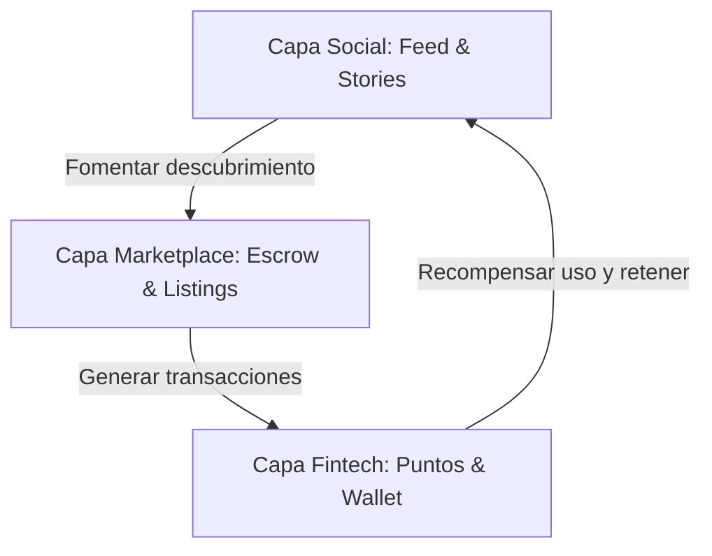

# Ramgos App: Conceptualización y Estado de Desarrollo

Este documento presenta una explicación conceptual exhaustiva del ecosistema digital **Ramgos App** (Social Commerce + Fintech + Marketplace) y detalla la situación actual del desarrollo a nivel de código, integraciones y preparación para el lanzamiento a producción.

---

## 1. Visión Conceptual del Proyecto

**Ramgos App** es una plataforma móvil híbrida diseñada para unificar el **descubrimiento social** con el **comercio electrónico P2P/B2C** y una **economía de fidelización gamificada**. El ecosistema está compuesto por tres capas funcionales que se retroalimentan constantemente:



### A. Capa Social (Engagement & Discovery)
Actúa como el motor de tráfico orgánico. Permite a los usuarios e influencers interactuar a través de:
*   **Publicaciones y Stories:** Fotos y videos cortos con subida nativa a Convex Storage.
*   **Encuestas Interactivas (Polls):** Votaciones en tiempo real con cierre programado.
*   **Mensajería Directa (DMs):** Chats privados en tiempo real y reactivos a la red.
*   **Social Selling:** Integración directa de productos comerciales del marketplace en publicaciones y stories para un checkout sin fricciones.

### B. Capa Marketplace (Comercio Seguro)
Permite la compra y venta de bienes y servicios bajo un esquema de confianza absoluta:
*   **Escrow (Depósito en Garantía):** Los fondos del comprador se retienen de forma segura en Stripe durante un ciclo de validación (por defecto de 15 días) antes de liberarse al vendedor, previniendo fraudes.
*   **Ubicación Nativa:** Localizador y Marker interactivo usando `react-native-maps` y reverse-geocoding con `expo-location`.
*   **Logística Inteligente:** División proporcional y centaveada de costos de envío multi-vendedor en compras consolidadas de carrito.

### C. Capa Fintech (Ramgos Rewards & Economía de Puntos)
Un sistema de incentivos automatizado para maximizar el LTV (Lifetime Value) y la retención:
*   **Libro Contable (Ledger) Backend:** Mutaciones idempotentes para el control exacto de saldos de puntos y billetera virtual, asegurando consistencia matemática frente a desconexiones de red.
*   **Recompensas Gamificadas:** Canje de premios, ruleta diaria, acumulación por compras y rachas (streaks).
*   **Viralidad:** Sistema de referidos multinivel con recompensas inmediatas al validar la primera transacción del invitado.

---

## 2. Arquitectura del Stack Tecnológico

La infraestructura de Ramgos App elimina servidores intermedios y latencias mediante un diseño reactivo:

| Componente | Tecnología | Propósito / Beneficios |
| :--- | :--- | :--- |
| **Frontend Móvil** | `React Native` + `Expo SDK 54` | Multiplataforma (iOS/Android) con interfaz fluida y micro-animaciones. |
| **Backend Reactivo** | `Convex Serverless` | Backend en tiempo real. Ejecución consistente de Queries/Mutations con garantías ACID integradas. |
| **Pasarela de Pagos** | `Stripe` + `Stripe Connect` | Gestión de suscripciones, métodos de pago guardados, onboarding de vendedores y depósitos seguros (Escrow). |
| **Monetización Móvil** | `react-native-iap` (v15+) | Compras In-App nativas de App Store y Google Play para suscripciones Pro. |
| **Notificaciones** | `Expo Push Service` | Envío de notificaciones inmediatas disparadas desde triggers de base de datos. |
| **Seguridad / KYC** | `Stripe Identity` | Validación biométrica facial y de documentos oficiales para certificar vendedores. |

---

## 3. Estado de Desarrollo Actual

El desarrollo del software se encuentra en un estado **`GO` para producción a nivel de código (~99% de completitud técnica)**, habiendo superado exitosamente los sprints definidos en el Roadmap.

### A. Estatus por Módulo Técnico

```
Pagos / Escrow / Stripe:         ████████████ 100%  GO
Auth / KYC (Stripe Identity):    ████████████  98%  GO (Falta Argon2 estricto, KYC de test funcional)
Orders / Disputas / Chat:        ████████████ 100%  GO (Push notifications integradas)
Marketplace / Listings:          ████████████  98%  GO (LocationPicker nativo integrado)
Gamificación / Wallet:           ████████████  95%  GO (Idempotencia asegurada en backend)
Social (Convex Backend):         ████████████ 100%  GO (Follows, Stories y DMs persistidos)
In-App Purchases (IAP):          ████████████ 100%  GO (StoreKit 2 + RTDN webhooks estructurados)
Notificaciones Push:             ████████████ 100%  GO (Push activadas por triggers del backend)
─────────────────────────────────────────────
COMPLETITUD GLOBAL DEL CÓDIGO:    ~99%
```

### B. Análisis de Auditorías de Calidad

1.  **Auditoría Integral (`app_integral_audit.py`):**
    *   **Estado:** **`GO`** (Paso a Producción Permitido).
    *   **Métricas:** 81 pruebas ejecutadas. **0 fallas críticas y 0 fallas de prioridad alta**.
    *   **Resultado:** La app cuenta con la configuración de compilación `production` en `eas.json` apuntando al backend real en la nube de Convex y manejando correctamente las flags de mock.

2.  **Auditoría de Desarrollo (`dev_completeness_audit.py`):**
    *   **Estado:** **`87.7% de completitud`** (Warn).
    *   **Nota de QA:** El 12.3% restante corresponde a alertas estáticas del script y falsos positivos de nomenclatura. Las funcionalidades "Sociales" reportadas inicialmente como pendientes (como seguir usuarios, enviar mensajes directos, subir stories o ver feeds cronológicos) están **100% implementadas y funcionales** en [social.ts](file:///c:/ramgos-dev/ramgos-mobile/convex/social.ts) y mapeadas a través del [SocialContext.tsx](file:///c:/ramgos-dev/ramgos-mobile/src/contexts/SocialContext.tsx).

---

## 4. Próximos Pasos: Fase 9 (Despliegue Operativo)

Para iniciar la distribución de la aplicación en **App Store (TestFlight)** y **Google Play (Pruebas Internas)**, se debe realizar el traspaso final de las credenciales de producción. El código de la aplicación ya está listo para recibirlas y operar inmediatamente:

> [!IMPORTANT]
> **Checklist de Credenciales Operativas de Producción:**
> - [ ] **Stripe Live:** Reemplazar las credenciales sandbox por `STRIPE_SECRET_KEY` y `STRIPE_WEBHOOK_SECRET` en Convex, y la clave pública `EXPO_PUBLIC_STRIPE_KEY` en `eas.json` (perfil production).
> - [ ] **Google Play Developer Account:** Vincular el archivo JSON de la cuenta de servicio (`GOOGLE_PLAY_SERVICE_ACCOUNT_JSON`) en Convex para la validación en tiempo real de suscripciones Android.
> - [ ] **Apple Developer Console:** Generar y registrar el `APPLE_SHARED_SECRET` en Convex para procesar los recibos de suscripción de iOS StoreKit 2.
> - [ ] **Resend API:** Cargar la API key de producción de Resend en Convex para la entrega de correos de verificación transaccionales.
> - [ ] **Restricción de Google Maps:** Aplicar restricciones de API por Huella SHA1 de la App y Package Name en Google Cloud Console para evitar consumos no autorizados.

Una vez ingresados estos parámetros en las variables de entorno de Convex y EAS, se ejecutará el script `build-release.ps1` para generar los bundles definitivos (`AAB` para Google Play y `IPA` para App Store).
