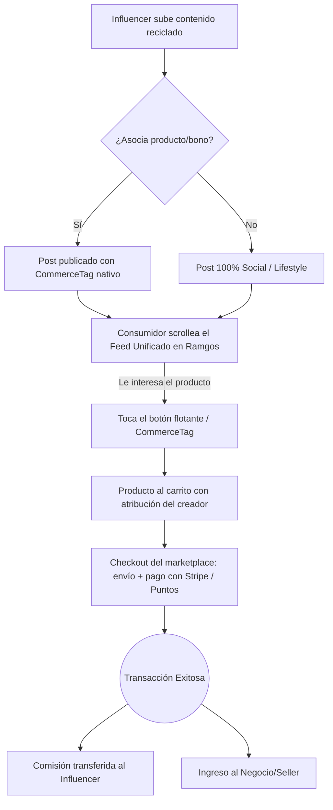

# Arquitectura y Conceptualización: Ramgos Social-Commerce Hub

> [!IMPORTANT]
> **Alcance del Documento:** Este documento **no transforma toda la aplicación**. Toda la arquitectura, flujogramas y componentes aquí descritos aplican **exclusivamente al módulo de Red Social** de Ramgos. El resto de las funciones de la app (dashboards, sistema de reservas, KYC, etc.) mantienen su estructura original.

## 1. Concepto General
Ramgos Social-Commerce Hub es la evolución del consumo de contenido. Busca fusionar las características más adictivas de los tres gigantes (la retención visual del feed infinito de TikTok, la familiaridad y cercanía de las historias y carruseles de Instagram, y la inmediatez de los hilos de Twitter) en una única plataforma unificada.

La diferencia radical es su lógica de **social-commerce sutil**. Los influencers pueden duplicar o resubir el contenido que ya crean para las redes de Meta, X o ByteDance, pero aquí cada publicación puede ser un escaparate transaccional nativo. Sin necesidad de "ir al link en la bio" ni salir de la app, los creadores monetizan su tráfico en tiempo real mediante botones de compra incrustados directamente en el contenido.

> [!IMPORTANT]
> **El pago SIEMPRE pasa por el carrito del marketplace.** Tocar el CommerceTag de un post agrega el producto al carrito (con la atribución del creador) y abre el carrito; de ahí en adelante la compra sigue el checkout normal, con stock, envío y escrow. Esto es una decisión de producto deliberada y **obligatoria**: no existe —ni debe existir— un checkout paralelo dentro del feed. Las versiones previas de este documento describían un "One-Click In-App Checkout" con un modal de pago sobre el video; eso quedó descartado.

## 2. Análisis Funcional (Roles de Usuario)

* **Consumidores (Usuarios Regulares):**
  * **Experiencia:** Consumen contenido de forma fluida y sin fricción. Mientras navegan por el feed unificado, si ven un producto que les interesa en un reel o foto, interactúan con un elegante botón superpuesto y concretan la compra (o reclaman un bono) en un solo toque, utilizando su saldo o tarjeta guardada.
* **Influencers (Generadores de Tráfico):**
  * **Experiencia:** Reciclan su contenido existente. Al subirlo a Ramgos, pueden asociarlo al catálogo de un negocio o a un bono propio. Actúan como un canal de ventas descentralizado, cobrando comisiones automáticas por cada venta generada desde su publicación.
* **Negocios (Vendedores):**
  * **Experiencia:** Crean perfiles comerciales y suben sus productos o servicios. Se benefician del tráfico orgánico que dirigen los influencers hacia sus artículos, tercerizando el esfuerzo de marketing a cambio de un porcentaje (comisión).

## 3. Análisis FODA y Contra-Quiebres (Competencia)

### Análisis FODA de Redes Sociales Actuales (IG, TikTok, X)
* **Fortalezas:** Tráfico masivo global, algoritmos hiper-adictivos, adopción universal, herramientas de edición robustas.
* **Debilidades:** 
  * Fricción de conversión: Múltiples clicks para llegar a un checkout, obligación de salir de la app.
  * Algoritmos punitivos: Penalizan severamente el alcance (shadowban) si el creador incluye enlaces externos ("link en bio").
* **Amenazas:** Creadores agotados por los constantes cambios de algoritmo y baja rentabilidad real respecto al volumen de visualizaciones.
* **Oportunidades:** Crear un ecosistema donde el objetivo principal del algoritmo sea facilitar y premiar la transacción.

### Los Contra-Quiebres (Soluciones Ramgos)
1. **Zero-Penalty Algorithm:** Lejos de castigar al creador por vender, el algoritmo de Ramgos premia los posts que generan transacciones, aumentando sus impresiones a mayor tasa de conversión.
2. **Compra sin salir de la app:** Se elimina la fuga de usuarios. Desde el post, el producto va directo al carrito de Ramgos con la atribución del creador, y el pago se completa en el checkout del marketplace — nunca en un navegador externo ni en un "link en bio". El paso por el carrito es obligatorio: da stock, envío y escrow reales.
3. **Repurposing Amigable:** No se castiga el contenido con marca de agua de TikTok. Se prioriza la utilidad comercial sobre la exclusividad del clip.

## 4. Flujograma

## 5. Lógica del Algoritmo (Motor de Recomendación)

> [!IMPORTANT]
> **El feed por defecto es ALGORÍTMICO ("Para ti"), igual que X/Instagram hoy.** Decisión de producto (2026-08-20, bitácora E-085) que **revierte deliberadamente** la decisión anterior (2026-08-18) de que el default fuera cronológico.
>
> Hay un tab cronológico explícito, **"Siguiendo"** (`mode: 'following'`), como alternativa — no al revés. El riesgo que motivó el cronológico-por-default (con catálogo chico, un feed rankeado puede esconder un post recién subido) **no se da por resuelto**, sólo se mitiga con oversample + cap de diversidad por autor; es un riesgo abierto documentado en el plan de ranking (`docs/PLAN_ESTRATEGICO_MAESTRO.md` §16, E-085).
>
> **Loops (Reels) tiene su propio scorer separado** (`scoreLoop`, distinto de `scorePost`): rankea por TASAS de engagement (completion/like/comment/share/rewatch sobre `viewCount`, no conteos absolutos) y depende mucho menos del grafo social — la personalización es por interés de contenido (`socialTagAffinity`, alimentada sólo por eventos de Loops), no por a quién seguís. Además tiene un mecanismo de exploración/graduación por etapas ("bandit-lite" vía cron, ver §10) para que un video nuevo no quede invisible mientras junta sus primeras vistas.

El motor de recomendación de Feed (modos `forYou`/`following`, ambos siempre disponibles) es un algoritmo híbrido que aprende dinámicamente del comportamiento del usuario:

1. **Decodificación por Interacción:** A medida que el usuario da "Me gusta", visualiza videos completos, comenta o manda un DM, el algoritmo actualiza una afinidad graduada por autor (`socialAuthorAffinity`, EMA con media vida de 14 días) y comienza a inyectar más contenido de esas personas — no una regla booleana de "le gustó alguna vez sí/no".
2. **Priorización de Geolocalización (Comercial):** La ubicación geográfica del usuario es **primordial** para el contenido transaccional. Si el usuario está en Argentina, el algoritmo priorizará mostrar posts con CommerceTags de negocios o influencers locales (y no productos de España o Estados Unidos). 
3. **Fronteras Abiertas (Social):** Aunque lo comercial está fuertemente geolocalizado para asegurar la viabilidad de la compra/envío, el contenido puramente social o de *lifestyle* no está restringido de forma estricta, permitiendo al usuario interactuar con creadores de cualquier parte del mundo.

## 6. Perfiles Híbridos y Comunidades Comerciales

### A. El Perfil Híbrido (El Escaparate)
El perfil de un usuario es la síntesis perfecta entre Instagram y Twitter, pero potenciado para ventas:
* **Para Influencers y Negocios:** Tienen una pestaña principal de contenido (Feed/Reels) y una **pestaña dedicada al Catálogo/Marketplace** directamente en su perfil. Todo lo que el influencer promociona (bonos) o el negocio vende, está listado ahí.
* **El "Link en Bio" obsoleto:** Ya no hace falta redirigir al usuario fuera de la app; el catálogo *es* parte del perfil nativo.

### B. Comunidades Comerciales (El Shopping Digital)
Inspirado en los "Mejores Amigos" de IG, las "Comunidades" de Twitter y las "Notas":
* **Usuarios:** Pueden tener grupos privados para compartir contenido exclusivo.
* **Negocios (Digitalización de Pasillos Comerciales):** Los negocios pueden crear o unirse a **Comunidades Comerciales**: varios vendedores del mismo rubro comparten un espacio para postear y **compiten entre sí por vender más** de ese nicho (ej. "Comunidad de Vendedores de Palermo"), digitalizando la experiencia de un centro comercial. **Sin reparto de comisiones entre miembros** — una comunidad no es un vehículo de comisión cruzada; la única figura que cobra comisión de una venta en toda la app es un usuario `influencer` vía campaña (§2).

### C. Eventos y Matching (Tinder Interno)
Para potenciar la presencialidad y la vida nocturna o social, la red integra un sistema de **Matching en Eventos**:
* **Activación por Evento:** Cuando un negocio (ej. discoteca, restaurante) crea un evento, los asistentes pueden "confirmar asistencia" y habilitar el modo *Matching*.
* **Tinder-Style Adaptable:** Los usuarios escogen qué tipo de conexión buscan en ese evento específico:
  - **Socio-afectivo (Dating/Hookup):** Para quienes buscan pareja (formal o informal).
  - **Amistad / Networking:** Para quienes solo buscan conocer gente o hacer negocios.
* **Privacidad:** Totalmente opt-out. Si un usuario no quiere participar, simplemente apaga el switch. Al hacer *match*, se habilita automáticamente un chat privado (DM) en la app.

## 7. Reglamento de Desarrollo
1. **Fricción Mínima (Dogma):** Llegar del post al carrito debe ser **un solo toque**. El checkout posterior es el del marketplace y no se recorta: stock, envío y escrow no son negociables. (Antes este punto exigía "máximo 2 clicks hasta aprobar el pago"; se reemplazó al fijar que el pago pasa obligatoriamente por el carrito.)
2. **Performance Crítica:** El feed unificado debe renderizar a 60fps sin cuelgues, independientemente de si hay videos pesados. Obligatorio el uso de reciclaje de vistas.
3. **Diseño "Liquid Glass":** Los botones de comercio deben ser sutiles, elegantes y translúcidos (BlurView) para no arruinar la estética del contenido original.
4. **Transparencia Financiera:** Los dashboards de Influencers y Negocios deben reflejar las ventas en tiempo real sin demoras.

## 8. Arquitectura de Software
* **Frontend:** React Native (Expo). Uso de `@shopify/flash-list` para el feed continuo de alto rendimiento y `expo-video` para el streaming y pre-caching agresivo de multimedia.
* **Backend:** Convex. Estructura Serverless NoSQL, ideal para manejar alta concurrencia de lecturas en el feed (WebSockets) y transacciones seguras (Mutations).
* **Infraestructura de Pagos (Monetización Real):** **Stripe Connect es la única pasarela.** Transacciones reales y Split Payments automáticos entre negocio, influencer y plataforma. *(MercadoPago figuraba antes en este documento; existía sólo como un proveedor simulado del lado del cliente y fue eliminado del código — ver `src/services/fintech/paymentProviders.ts`.)*
* **Motor de Gamificación (Economía Interna):** Paralelo al sistema de pagos, la app cuenta con un **Sistema de Puntos**. Las interacciones (likes, matchings, compras) generan puntos individuales que pueden canjearse por descuentos. **Importante: Los puntos son intransferibles y no suplen al dinero real para el pago de comisiones.**

## 9. Módulos, Componentes y Funciones

### 🧩 Módulo 1: Core Social (Consumo)
**Componentes Internos:**
* `<UnifiedFeed />`: El contenedor principal (FlashList) que mezcla videos, carruseles y texto.
* `<PostCard />`: Componente dinámico. Renderiza el contenido según su tipo (VideoPlayer, carrusel de imágenes, texto).
  * **Carrusel:** un post con varias imágenes las muestra TODAS, deslizables en horizontal, con indicador de puntos.
  * **Encuadre:** las imágenes se ven **completas** dentro del encuadre del post (`resizeMode="contain"`), nunca recortadas. Como eso deja bandas, detrás va una copia de la misma imagen recortada y desenfocada para rellenar.
* `<StoriesBar />` / `<StoryViewer />`: Visor inmersivo a pantalla completa para contenido efímero (24hs).

**Funciones Internas (Convex & Hooks):**
* `getUnifiedFeed(cursor, limit)`: Carga el contenido paginado mezclando el algoritmo de intereses.
* `toggleLike(postId)`: Mutación optimista para "Me gusta".
* `addView(postId)`: Registro asíncrono de impresiones.
* `sendDirectMessage(chatId, body)`: Responder a historias o posts por DM.

### 🧩 Módulo 2: Social-Commerce (Monetización)
**Componentes Internos:**
* `<CommerceTag />`: El botón superpuesto sobre el `<PostCard />`. Muestra el precio o el descuento. Un toque = producto al carrito.

**Funciones Internas (Convex & Hooks):**
* `commerce.addPostProductToCart(postId)`: Resuelve el producto del post en el servidor y lo agrega al carrito **con la atribución del creador**, para que la comisión se liquide después en el checkout normal.
* `commerce.getPostCommerceOffer(postId)`: Hidrata precio/descuento/stock del CommerceTag.
* `commerce.internalRecordSocialSalesForOrder(...)`: Al confirmarse el pago, escribe la fila de `socialPostSales` (atribución y split: plataforma / creador / vendedor).

> Este módulo **ya no incluye** `<OneClickCheckoutSheet />` ni `claimFromPost()`. Ambos figuraban en versiones previas de este documento; el sheet fue eliminado del repo y la mutation nunca llegó a existir. El pago pasa obligatoriamente por el carrito (ver §1).

### 🧩 Módulo 3: Creator Studio (Publicación)
**Componentes Internos:**
* `<CreatePost />` (Selector de media): Selector ultrarrápido de galería integrado en el flujo de creación.
* `<CommerceLinker />`: Modal para que el creador busque y asocie un producto o bono existente a su post antes de publicarlo.

**Funciones Internas (Convex & Hooks):**
* `generateUploadUrl()`: Obtiene URL segura de Convex Storage.
* `createPost(mediaUrl, text, type, attachedListingId?)`: Impacta el nuevo post en la base de datos, asociando el producto si lo hubiera.

## 10. Análisis de Brechas (Gap Analysis)

### Hecho (tab Social del navbar — Oleada A)
Entrada: `HomeScreen` → sección `social` → `SocialScreen`.

| Capacidad | Estado |
|---|---|
| Feed + Loops (`getFeed`, paginación) | Hecho |
| Stories (crear / ver / `viewStory`) | Hecho |
| Creator Studio + CommerceLinker + `attachedListingId` | Hecho |
| CTA comercial → producto al carrito con atribución del creador | Hecho |
| Likes / comentarios / save / delete / follow vía Convex | Hecho |
| DMs (`DirectMessages` + share a chat) | Hecho |
| Búsqueda de usuarios | Hecho |
| Perfil híbrido (`HybridProfile` registrado) | Hecho |
| Seguidores = `socialFollows` / `socialUsers.followerCount` | Hecho |

### Hecho (Fases RS-2 a RS-8, 2026-08-18 — ver §15.2 del Plan Maestro)

| Capacidad | Estado |
|---|---|
| `UnifiedFeed` en `@shopify/flash-list` (era FlatList) | Hecho |
| Algoritmo de ranking v2: geo + afinidad + **watch-time** + **conversión comercial** + "no me interesa" + anti-repetición + cap de diversidad por autor | Hecho |
| Gamificación social: puntos por publicar/comentar/story/unirse a comunidad/hito de 10 likes, con clawback anti-abuso | Hecho |
| Comunidades comerciales: crear/unirse/aprobar, feed y catálogo de comunidad, chat vía `social/dm.ts` | Hecho |
| Moderación completa: reportes, mute, ocultar, filtro de palabras, shadowban/suspensión, cola admin | Hecho |
| Hilos, quote-repost, hashtags + trending, menciones, bandeja de Actividad real | Hecho |
| Ban efectivo también vía OAuth (antes sólo cortaba sesiones server-side) | Hecho |
| Puntos server-authoritative (antes el cliente mandaba el monto) | Hecho |

### Hecho (Fases RS-9 y RS-10, 2026-08-18 — ver §15.3 del Plan Maestro)

| Capacidad | Estado |
|---|---|
| Matching de eventos (Sprint 5): opt-in gateado por entrada confirmada, deck de swipe, match mutuo → chat automático | Hecho |
| Posts fijados, encuestas con UI de resultados, colecciones de guardados, mejores amigos (audiencia de historias), borradores y publicación programada | Hecho |
| **Carrusel de imágenes** en el feed, con la foto completa en el encuadre (`contain` + fondo desenfocado) | Hecho |
| ~~**Feed cronológico por orden de subida** como comportamiento por defecto~~ | **Revertido 2026-08-20** — ver fila de ranking dual abajo y E-085 |
| **Stripe como única pasarela** (se eliminó el proveedor MercadoPago simulado) | Hecho |

### Hecho (cierre de brechas, 2026-08-20)

| Capacidad | Estado |
|---|---|
| **Video en `contain`** (como las imágenes): segunda `VideoView` del mismo `player` en `cover`+blur de fondo, la de encima en `contain` | Hecho — `PostCard.tsx` |
| **Pool de reproductores de video**: `useVideoPlayerPool` (3 fijos, `slot = index % 3`, `replaceAsync` en vez de crear/destruir) — de paso, `LoopItem`/`LoopFeed` migraron de `expo-av` (deprecado) a `expo-video` | Hecho — `src/hooks/useVideoPlayerPool.ts` |
| **CommerceTag "Liquid Glass" holográfico**: reescrito sobre `GlassSurface`/`glass.ts` + borde iridiscente (`LinearGradient`) | Hecho — `CommerceTag.tsx` |
| **UI de alt-text** en el composer: botón "Aa" por miniatura, editor inline, viaja en `createPost` | Hecho — `InlineComposer.tsx` |
| **`StoryViewer` migrado a `shareStoryInChat`**: la respuesta a una historia manda el adjunto real, no un texto con prefijo | Hecho — `StoryViewer.tsx` |
| **Link preview cards**: OG metadata fetcheada server-side en background al publicar (`social/linkPreview.ts`), cacheada por URL, renderizada en `Post.tsx`/`PostCard.tsx` para posts de puro texto | Hecho |
| **Discovery unificado** (personas + productos en un buscador): `convex/discovery.ts` corre las dos búsquedas en paralelo; **full-text sobre índices de Convex, NO semántico/vectorial** (no hay proveedor de embeddings en el stack — ver nota en el archivo) | Hecho (con esa salvedad) — `UserSearch.tsx` |

### Hecho (ranking dual Feed/Loops, 2026-08-20 — E-085/E-086, ver §15.4 del Plan Maestro)

| Capacidad | Estado |
|---|---|
| **Feed "Para ti" (algorítmico) como default**, tab "Siguiendo" (cronológico) como alternativa explícita — reversión deliberada de E-080 | Hecho — `getFeed` en `convex/social.ts`, `SocialScreen.tsx` |
| `scorePost` v2: + término de velocidad de engagement normalizado por edad, + afinidad graduada (`socialAuthorAffinity`, EMA persistida, media vida 14 días) en vez del scan booleano de "últimos 50 likes" | Hecho — `convex/social/scoring.ts` |
| **`scoreLoop`**: scorer separado para Loops, por TASAS (completion/like/comment/share/rewatch/quick-skip sobre `viewCount`), casi sin depender del grafo social | Hecho — `convex/social/scoring.ts` |
| **`socialTagAffinity`**: afinidad por hashtag/interés, alimentada SOLO por eventos de Loops (nunca por el Feed) — la "segmentación de contenido" pedida | Hecho |
| **Exploración/graduación por etapas de Loops** ("bandit-lite" sin ML real todavía): slots garantizados para contenido nuevo, cron de graduación por percentil (`social/loopsTiering.ts`), multiplicador por tier | Hecho |
| **Instrumentación real de watch-time**: `SocialScreen` migrado a `UnifiedFeed` (antes no mandaba ninguna señal de vista); `LoopItem` ahora manda completion/skip rápido/rewatch reales del player, no sólo una impresión al entrar | Hecho |
| `socialPosts.shareCount` real, incrementado sólo al compartir por DM (`sharePostInChat`/`shareToUser`) — el único funnel no falseable sin mandar un mensaje real | Hecho |
| Cap de diversidad generalizado por clave (autor en Feed, hashtag de mayor afinidad en Loops) | Hecho — `applyDiversityCap` |
| Tests unitarios de los scorers (funciones puras, sin runtime de Convex) | Hecho — `convex/__tests__/socialScoring.test.ts` |

### Aún abierto
1. **Sonidos reutilizables** (estilo TikTok: catálogo, "usar este sonido" al crear un post nuevo) — no se implementó. Necesita extraer/recortar el audio de un video existente para reutilizarlo en uno nuevo, y este stack (Expo/RN) no tiene ninguna librería de procesamiento de audio/video instalada; es una decisión de infraestructura aparte (¿procesamiento client-side vía librería nativa, o un servicio server-side?), no un gap chico.
2. **Discovery semántico/vectorial de verdad** (embeddings): lo que hay hoy (`convex/discovery.ts`) es full-text, no semántico — para "zapatillas para correr" encontrar "tenis de running" hace falta un proveedor de embeddings, que no está elegido todavía.

> **Nota:** `claimFromPost` salió de esta lista porque ya no es una brecha sino una decisión: el pago pasa por el carrito y no habrá una mutation de checkout dentro del feed (ver §1). Asimismo, **`communityAgreements`** (convenios de comisión cruzada entre miembros de una comunidad) fue **eliminado por completo** (código + tabla del schema, 2026-08-20) — no es una brecha pendiente, es una decisión de producto: las comunidades son un espacio para postear en un nicho compartido y competir por vender más, sin repartirse comisiones entre sí. La única figura que cobra comisión de una venta en toda la app es un usuario `influencer` vía campaña (§2, `campaigns.internalResolveCartAttribution`).

---

## 11. Plan de Desarrollo (Scrum / Sprints)

Para ejecutar esta visión de forma clínica, dividiremos el trabajo en 5 Sprints exhaustivos. Cada tarea debe cumplir el "Dogma de Fricción Cero" y la directiva de diseño "Liquid Glass".

### 🏃 Sprint 1: El Lienzo (Feed Unificado y Perfiles Híbridos)
**Objetivo:** Construir la base de alto rendimiento para consumo de contenido y la vitrina comercial de los usuarios.
* **Frontend (React Native / UI):**
  - `UnifiedFeed.tsx`: Implementar `@shopify/flash-list` para scroll infinito. Pre-caching de video estricto.
  - `PostCard.tsx`: Componente modular que renderiza video, carrusel de imágenes o hilo de texto dinámicamente.
  - `HybridProfileScreen.tsx`: Refactor del perfil actual. Agregar `TopTabs` (Feed | Catálogo | Bonos) para matar la fricción del "Link en Bio".
* **Backend (Convex):**
  - Tabla `posts`: Esquema con `authorId`, `type` (video/image/text), `mediaUrls`, `content`, `metrics` (likes, views, clicks).
  - Query paginada `getUnifiedFeed(cursor, geolocation?)` con motor de recomendación v1.
  - Mutaciones: `createPost`, `toggleLike`, `registerView`.
* **Criterio de Éxito:** El feed escrollea a 60fps constantes incluso con 10 videos cargados en memoria.

### 🏃 Sprint 2: El Gancho (Social-Commerce UI & Creator Studio)
**Objetivo:** Inyectar la capa transaccional al contenido de forma elegante e intuitiva.
* **Frontend (React Native / UI):**
  - `CommerceTag.tsx`: Botón holográfico (BlurView) superpuesto al `PostCard`. Muestra precio/descuento en mini-formato.
  - `CreatorStudioModal.tsx` (`CreatePost.tsx`): Flujo de subida de contenido expandido. Ahora cuenta con un botón "Vincular Producto" que levanta el modal `<CommerceLinker />`.
  - `CommerceLinker.tsx`: Componente de búsqueda que consulta `api.listings.searchListings` para vincular un `listingId` al post.
  - Al tocar el CommerceTag, el producto va al carrito con la atribución del creador y se abre el carrito. **No hay bottom sheet de pago sobre el video** (ver §1).
* **Backend (Convex):**
  - Mutación `createPost`: Ahora acepta `attachedListingId`. Si se recibe, el backend consulta internamente los datos del producto (precio, imagen, nombre) y guarda el objeto desnormalizado `commercialProduct` en el documento del post, optimizando la carga masiva del feed en O(1).
  - Query `getPostCommerceOffer(postId)` para hidratar el CommerceTag instantáneamente.
* **Criterio de Éxito:** Un influencer puede subir un video, atacharle una zapatilla de un negocio local y publicarlo en menos de 1 minuto.

### 🏃 Sprint 3: Economía Dual (Transacciones Reales y Gamificación)
**Objetivo:** Cerrar el ciclo financiero (pagos) y el ciclo de retención (puntos).
* **Frontend (Pagos & Gamificación):**
  - Integrar UI de Checkout (Stripe en modo test) en el flujo del carrito, al que llega el producto desde el post.
  - Slider interactivo para "Usar mis Puntos como Descuento".
  - Animaciones de partículas/haptics al ganar puntos por likes o compras.
* **Backend (Convex):**
  - Mutación `processSimulatedPayment(postId, mockToken)` ejecutando el **Split Payment**: % Influencer, % Negocio, % Plataforma. *(Aclaración: Por ahora los pagos de dinero real son SIMULADOS para testear el flujo sin fricción bancaria)*.
  - Motor de Gamificación: `awardPoints(userId, actionType)`. (Ej: +5 puntos por dar 10 likes).
* **Criterio de Éxito:** Desde un video, un toque deja el producto en el carrito con la atribución correcta; al completar el checkout, el dinero se reparte en los dashboards. Los puntos jamás se transfieren entre usuarios.

### 🏃 Sprint 4: Retención Dura (DMs y Comunidades Comerciales)
**Objetivo:** Crear un foso competitivo reteniendo a los usuarios dentro de la plataforma para socializar y comerciar en grupo.
* **Frontend (React Native / UI):**
  - `InboxScreen.tsx` y `ChatRoomScreen.tsx`: Interfaz de mensajería en vivo.
  - `CommunitiesDashboard.tsx`: UI estilo "Mejores Amigos" o Grupos para que los Negocios formen asociaciones ("Pasillos Digitales").
* **Backend (Convex):**
  - Conectar UI con la tabla `socialChats` y `messages` existente mediante suscripciones (WebSockets / `useQuery`).
  - Tabla `commercialCommunities`, `communityMembers` y lógica de roles/membresía (sin reparto de comisiones entre miembros).
* **Criterio de Éxito:** Los usuarios pueden responder a una Historia y transicionar fluidamente a un chat privado en tiempo real.

### 🏃 Sprint 5: Eventos y Matching (El "Tinder" Interno)
**Objetivo:** Digitalizar la interacción presencial en eventos nocturnos/sociales.
* **Frontend (React Native / UI):**
  - Switch opt-in de "Matching" en el detalle de un evento.
  - UI de Swipe (Tarjetas deslizables) filtrando por intención: *Socio-Afectivo* vs *Networking*.
* **Backend (Convex):**
  - Tabla `eventMatches`: `eventId`, `userA`, `userB`, `status` (pending, matched, rejected).
  - Al generar un match, disparar trigger que crea un `socialChat` privado entre ambos.
* **Criterio de Éxito:** Las personas en el mismo evento pueden conocerse digitalmente y chatear, todo con privacidad opt-in absoluta.

