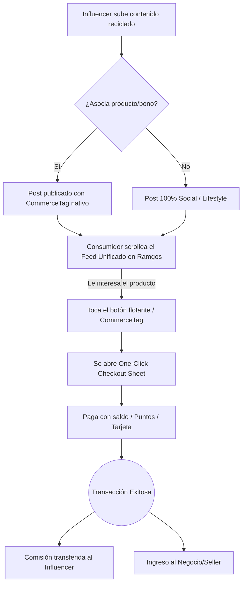

# Arquitectura y Conceptualización: Ramgos Social-Commerce Hub

> [!IMPORTANT]
> **Alcance del Documento:** Este documento **no transforma toda la aplicación**. Toda la arquitectura, flujogramas y componentes aquí descritos aplican **exclusivamente al módulo de Red Social** de Ramgos. El resto de las funciones de la app (dashboards, sistema de reservas, KYC, etc.) mantienen su estructura original.

## 1. Concepto General
Ramgos Social-Commerce Hub es la evolución del consumo de contenido. Busca fusionar las características más adictivas de los tres gigantes (la retención visual del feed infinito de TikTok, la familiaridad y cercanía de las historias y carruseles de Instagram, y la inmediatez de los hilos de Twitter) en una única plataforma unificada.

La diferencia radical es su lógica de **social-commerce sutil**. Los influencers pueden duplicar o resubir el contenido que ya crean para las redes de Meta, X o ByteDance, pero aquí cada publicación puede ser un escaparate transaccional nativo. Sin necesidad de "ir al link en la bio" ni salir de la app, los creadores monetizan su tráfico en tiempo real mediante botones de compra o reclamo de bonos incrustados directamente en el contenido.

## 2. Análisis Funcional (Roles de Usuario)

* **Consumidores (Usuarios Regulares):**
  * **Experiencia:** Consumen contenido de forma fluida y sin fricción. Mientras navegan por el feed unificado, si ven un producto que les interesa en un reel o foto, interactúan con un elegante botón superpuesto y concretan la compra (o reclaman un bono) en un solo toque, utilizando su saldo o tarjeta guardada.
* **Influencers (Generadores de Tráfico):**
  * **Experiencia:** Reciclan su contenido existente. Al subirlo a Ramgos, pueden asociarlo al catálogo de un negocio o a un bono propio. Actúan como un canal de ventas descentralizado, cobrando comisiones automáticas por cada venta generada desde su publicación.
* **Negocios (Vendedores):**
  * **Experiencia:** Crean perfiles comerciales y suben sus productos o servicios. Se benefician del tráfico orgánico que dirigen los influencers hacia sus artículos, tercerizando el esfuerzo de marketing a cambio de un porcentaje (comisión).

## 3. Análisis FODA y Contra-Quiebres (Competencia)

### Análisis FODA de Redes Sociales Actuales (IG, TikTok, X)
* **Fortalezas:** Tráfico masivo global, algoritmos hiper-adictivos, adopción universal, herramientas de edición robustas.
* **Debilidades:** 
  * Fricción de conversión: Múltiples clicks para llegar a un checkout, obligación de salir de la app.
  * Algoritmos punitivos: Penalizan severamente el alcance (shadowban) si el creador incluye enlaces externos ("link en bio").
* **Amenazas:** Creadores agotados por los constantes cambios de algoritmo y baja rentabilidad real respecto al volumen de visualizaciones.
* **Oportunidades:** Crear un ecosistema donde el objetivo principal del algoritmo sea facilitar y premiar la transacción.

### Los Contra-Quiebres (Soluciones Ramgos)
1. **Zero-Penalty Algorithm:** Lejos de castigar al creador por vender, el algoritmo de Ramgos premia los posts que generan transacciones, aumentando sus impresiones a mayor tasa de conversión.
2. **One-Click In-App Checkout:** Se elimina la fuga de usuarios. El carrito y el pago ocurren dentro del mismo modal sobre el video, destruyendo la fricción.
3. **Repurposing Amigable:** No se castiga el contenido con marca de agua de TikTok. Se prioriza la utilidad comercial sobre la exclusividad del clip.

## 4. Flujograma

## 5. Lógica del Algoritmo (Motor de Recomendación)

El éxito del feed unificado recae en un algoritmo de recomendación híbrido que aprende dinámicamente del comportamiento del usuario:

1. **Decodificación por Interacción:** A medida que el usuario da "Me gusta", visualiza videos completos o comenta, el algoritmo descifra su "noción de intereses" en tiempo real y comienza a inyectar contenido similar.
2. **Priorización de Geolocalización (Comercial):** La ubicación geográfica del usuario es **primordial** para el contenido transaccional. Si el usuario está en Argentina, el algoritmo priorizará mostrar posts con CommerceTags de negocios o influencers locales (y no productos de España o Estados Unidos). 
3. **Fronteras Abiertas (Social):** Aunque lo comercial está fuertemente geolocalizado para asegurar la viabilidad de la compra/envío, el contenido puramente social o de *lifestyle* no está restringido de forma estricta, permitiendo al usuario interactuar con creadores de cualquier parte del mundo.

## 6. Perfiles Híbridos y Comunidades Comerciales

### A. El Perfil Híbrido (El Escaparate)
El perfil de un usuario es la síntesis perfecta entre Instagram y Twitter, pero potenciado para ventas:
* **Para Influencers y Negocios:** Tienen una pestaña principal de contenido (Feed/Reels) y una **pestaña dedicada al Catálogo/Marketplace** directamente en su perfil. Todo lo que el influencer promociona (bonos) o el negocio vende, está listado ahí.
* **El "Link en Bio" obsoleto:** Ya no hace falta redirigir al usuario fuera de la app; el catálogo *es* parte del perfil nativo.

### B. Comunidades Comerciales (El Shopping Digital)
Inspirado en los "Mejores Amigos" de IG, las "Comunidades" de Twitter y las "Notas":
* **Usuarios:** Pueden tener grupos privados para compartir contenido exclusivo.
* **Negocios (Digitalización de Pasillos Comerciales):** Los negocios pueden crear o unirse a **Comunidades Comerciales**. Esto permite que múltiples vendedores y promotores se asocien (ej. "Comunidad de Vendedores de Palermo") para generar tráfico cruzado, armar convenios y digitalizar la experiencia de un centro comercial.

### C. Eventos y Matching (Tinder Interno)
Para potenciar la presencialidad y la vida nocturna o social, la red integra un sistema de **Matching en Eventos**:
* **Activación por Evento:** Cuando un negocio (ej. discoteca, restaurante) crea un evento, los asistentes pueden "confirmar asistencia" y habilitar el modo *Matching*.
* **Tinder-Style Adaptable:** Los usuarios escogen qué tipo de conexión buscan en ese evento específico:
  - **Socio-afectivo (Dating/Hookup):** Para quienes buscan pareja (formal o informal).
  - **Amistad / Networking:** Para quienes solo buscan conocer gente o hacer negocios.
* **Privacidad:** Totalmente opt-out. Si un usuario no quiere participar, simplemente apaga el switch. Al hacer *match*, se habilita automáticamente un chat privado (DM) en la app.

## 7. Reglamento de Desarrollo
1. **Fricción Cero (Dogma):** Cualquier flujo de compra no debe superar los 2 clicks desde que el usuario ve el post hasta que se aprueba el pago.
2. **Performance Crítica:** El feed unificado debe renderizar a 60fps sin cuelgues, independientemente de si hay videos pesados. Obligatorio el uso de reciclaje de vistas.
3. **Diseño "Liquid Glass":** Los botones de comercio deben ser sutiles, elegantes y translúcidos (BlurView) para no arruinar la estética del contenido original.
4. **Transparencia Financiera:** Los dashboards de Influencers y Negocios deben reflejar las ventas en tiempo real sin demoras.

## 8. Arquitectura de Software
* **Frontend:** React Native (Expo). Uso de `@shopify/flash-list` para el feed continuo de alto rendimiento y `expo-video` para el streaming y pre-caching agresivo de multimedia.
* **Backend:** Convex. Estructura Serverless NoSQL, ideal para manejar alta concurrencia de lecturas en el feed (WebSockets) y transacciones seguras (Mutations).
* **Infraestructura de Pagos (Monetización Real):** Integración con pasarelas de pago (Stripe Connect / MercadoPago) para transacciones reales y Split Payments automáticos entre negocio, influencer y plataforma.
* **Motor de Gamificación (Economía Interna):** Paralelo al sistema de pagos, la app cuenta con un **Sistema de Puntos**. Las interacciones (likes, matchings, compras) generan puntos individuales que pueden canjearse por descuentos. **Importante: Los puntos son intransferibles y no suplen al dinero real para el pago de comisiones.**

## 9. Módulos, Componentes y Funciones

### 🧩 Módulo 1: Core Social (Consumo)
**Componentes Internos:**
* `<UnifiedFeed />`: El contenedor principal (FlashList) que mezcla videos, carruseles y texto.
* `<PostCard />`: Componente dinámico. Renderiza el contenido según su tipo (VideoPlayer, ImageSlider, ThreadText).
* `<StoryRing />` / `<StoryViewer />`: Visor inmersivo a pantalla completa para contenido efímero (24hs).

**Funciones Internas (Convex & Hooks):**
* `getUnifiedFeed(cursor, limit)`: Carga el contenido paginado mezclando el algoritmo de intereses.
* `toggleLike(postId)`: Mutación optimista para "Me gusta".
* `addView(postId)`: Registro asíncrono de impresiones.
* `sendDirectMessage(chatId, body)`: Responder a historias o posts por DM.

### 🧩 Módulo 2: Social-Commerce (Monetización)
**Componentes Internos:**
* `<CommerceTag />`: El botón holográfico superpuesto sobre el `<PostCard />`. Muestra el precio o el descuento.
* `<OneClickCheckoutSheet />`: Bottom sheet nativo (BottomSheetModal) que resume la compra y tiene el botón de "Confirmar Pago".

**Funciones Internas (Convex & Hooks):**
* `claimFromPost(postId, userId)`: Ejecuta la lógica transaccional, resta saldo/puntos y genera el recibo.
* `processSplitPayment(amount, influencerId, businessId)`: Función interna de pagos que liquida las comisiones.

### 🧩 Módulo 3: Creator Studio (Publicación)
**Componentes Internos:**
* `<MediaUploader />`: Selector ultrarrápido de galería.
* `<CommerceLinker />`: Modal para que el creador busque y asocie un producto o bono existente a su post antes de publicarlo.

**Funciones Internas (Convex & Hooks):**
* `generateUploadUrl()`: Obtiene URL segura de Convex Storage.
* `createPost(mediaUrl, text, type, attachedListingId?)`: Impacta el nuevo post en la base de datos, asociando el producto si lo hubiera.

## 10. Análisis de Brechas (Gap Analysis)

### Hecho (tab Social del navbar — Oleada A)
Entrada: `HomeScreen` → sección `social` → `SocialScreen`.

| Capacidad | Estado |
|---|---|
| Feed + Loops (`getFeed`, paginación) | Hecho |
| Stories (crear / ver / `viewStory`) | Hecho |
| Creator Studio + CommerceLinker + `attachedListingId` | Hecho |
| CTA comercial → `OneClickCheckoutSheet` + pago simulado | Hecho |
| Likes / comentarios / save / delete / follow vía Convex | Hecho |
| DMs (`DirectMessages` + share a chat) | Hecho |
| Búsqueda de usuarios | Hecho |
| Perfil híbrido (`HybridProfile` registrado) | Hecho |
| Seguidores = `socialFollows` / `socialUsers.followerCount` | Hecho |

### Aún abierto
1. **FlashList unificado estricto** (`@shopify/flash-list` + pre-cache video agresivo) — hoy FlatList + LoopFeed.
2. **CommerceTag holográfico** overlay tipo Liquid Glass (hoy card/CTA en el post).
3. **Algoritmo geo / intereses** — `getFeed` es cronológico.
4. **`claimFromPost` bono one-click** — no hay mutation dedicada; checkout de listing sí.
5. **Discovery vectorial** (personas + productos en una lupa).
6. **Comunidades comerciales** (Sprint 4).
7. **Matching de eventos** (Sprint 5).
8. **Gamificación social** (puntos por likes/posts) — puntos en checkout simulado sí.

---

## 11. Plan de Desarrollo (Scrum / Sprints)

Para ejecutar esta visión de forma clínica, dividiremos el trabajo en 5 Sprints exhaustivos. Cada tarea debe cumplir el "Dogma de Fricción Cero" y la directiva de diseño "Liquid Glass".

### 🏃 Sprint 1: El Lienzo (Feed Unificado y Perfiles Híbridos)
**Objetivo:** Construir la base de alto rendimiento para consumo de contenido y la vitrina comercial de los usuarios.
* **Frontend (React Native / UI):**
  - `UnifiedFeed.tsx`: Implementar `@shopify/flash-list` para scroll infinito. Pre-caching de video estricto.
  - `PostCard.tsx`: Componente modular que renderiza video, carrusel de imágenes o hilo de texto dinámicamente.
  - `HybridProfileScreen.tsx`: Refactor del perfil actual. Agregar `TopTabs` (Feed | Catálogo | Bonos) para matar la fricción del "Link en Bio".
* **Backend (Convex):**
  - Tabla `posts`: Esquema con `authorId`, `type` (video/image/text), `mediaUrls`, `content`, `metrics` (likes, views, clicks).
  - Query paginada `getUnifiedFeed(cursor, geolocation?)` con motor de recomendación v1.
  - Mutaciones: `createPost`, `toggleLike`, `registerView`.
* **Criterio de Éxito:** El feed escrollea a 60fps constantes incluso con 10 videos cargados en memoria.

### 🏃 Sprint 2: El Gancho (Social-Commerce UI & Creator Studio)
**Objetivo:** Inyectar la capa transaccional al contenido de forma elegante e intuitiva.
* **Frontend (React Native / UI):**
  - `CommerceTag.tsx`: Botón holográfico (BlurView) superpuesto al `PostCard`. Muestra precio/descuento en mini-formato.
  - `CreatorStudioModal.tsx` (`CreatePost.tsx`): Flujo de subida de contenido expandido. Ahora cuenta con un botón "Vincular Producto" que levanta el modal `<CommerceLinker />`.
  - `CommerceLinker.tsx`: Componente de búsqueda que consulta `api.listings.searchListings` para vincular un `listingId` al post.
  - `OneClickCheckoutSheet.tsx`: BottomSheet que emerge al tocar el CommerceTag. Muestra el resumen del ítem sin salir de la vista de video.
* **Backend (Convex):**
  - Mutación `createPost`: Ahora acepta `attachedListingId`. Si se recibe, el backend consulta internamente los datos del producto (precio, imagen, nombre) y guarda el objeto desnormalizado `commercialProduct` en el documento del post, optimizando la carga masiva del feed en O(1).
  - Query `getCommerceInfoForPost(postId)` para hidratar el BottomSheet instantáneamente.
* **Criterio de Éxito:** Un influencer puede subir un video, atacharle una zapatilla de un negocio local y publicarlo en menos de 1 minuto.

### 🏃 Sprint 3: Economía Dual (Transacciones Reales y Gamificación)
**Objetivo:** Cerrar el ciclo financiero (pagos) y el ciclo de retención (puntos).
* **Frontend (Pagos & Gamificación):**
  - Integrar UI de Checkout (Simulación de pasarela de pagos / Stripe en modo test) dentro de `OneClickCheckoutSheet.tsx`.
  - Slider interactivo para "Usar mis Puntos como Descuento".
  - Animaciones de partículas/haptics al ganar puntos por likes o compras.
* **Backend (Convex):**
  - Mutación `processSimulatedPayment(postId, mockToken)` ejecutando el **Split Payment**: % Influencer, % Negocio, % Plataforma. *(Aclaración: Por ahora los pagos de dinero real son SIMULADOS para testear el flujo sin fricción bancaria)*.
  - Motor de Gamificación: `awardPoints(userId, actionType)`. (Ej: +5 puntos por dar 10 likes).
* **Criterio de Éxito:** Simular el pago de un producto desde un video en solo 2 clicks y ver el dinero simulado repartirse en los dashboards. Los puntos jamás se transfieren entre usuarios.

### 🏃 Sprint 4: Retención Dura (DMs y Comunidades Comerciales)
**Objetivo:** Crear un foso competitivo reteniendo a los usuarios dentro de la plataforma para socializar y comerciar en grupo.
* **Frontend (React Native / UI):**
  - `InboxScreen.tsx` y `ChatRoomScreen.tsx`: Interfaz de mensajería en vivo.
  - `CommunitiesDashboard.tsx`: UI estilo "Mejores Amigos" o Grupos para que los Negocios formen asociaciones ("Pasillos Digitales").
* **Backend (Convex):**
  - Conectar UI con la tabla `socialChats` y `messages` existente mediante suscripciones (WebSockets / `useQuery`).
  - Tabla `commercialCommunities`, `communityMembers` y lógica de roles/convenios.
* **Criterio de Éxito:** Los usuarios pueden responder a una Historia y transicionar fluidamente a un chat privado en tiempo real.

### 🏃 Sprint 5: Eventos y Matching (El "Tinder" Interno)
**Objetivo:** Digitalizar la interacción presencial en eventos nocturnos/sociales.
* **Frontend (React Native / UI):**
  - Switch opt-in de "Matching" en el detalle de un evento.
  - UI de Swipe (Tarjetas deslizables) filtrando por intención: *Socio-Afectivo* vs *Networking*.
* **Backend (Convex):**
  - Tabla `eventMatches`: `eventId`, `userA`, `userB`, `status` (pending, matched, rejected).
  - Al generar un match, disparar trigger que crea un `socialChat` privado entre ambos.
* **Criterio de Éxito:** Las personas en el mismo evento pueden conocerse digitalmente y chatear, todo con privacidad opt-in absoluta.

