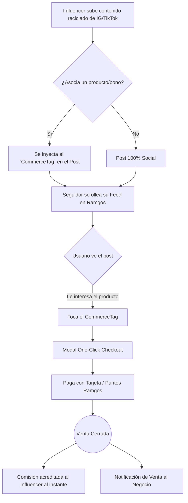


# 🚀 Arquitectura y Concepto: Ramgos Social-Commerce Hub

> [!TIP]
> **Visión del Producto:** Una red social unificada que absorbe la fricción. Los creadores reciclan el contenido que ya suben a TikTok, IG o X, pero con una diferencia clave: **cada post es un escaparate transaccional nativo**. Sin salir de la app, sin "Link en bio", monetización a un toque.

---

## 1. Concepto
**"El Hub del Creador"**
Ramgos busca fusionar los 3 formatos dominantes (Texto/Hilos a lo Twitter, Historias efímeras a lo IG, y Scroll infinito de Videos cortos a lo TikTok) bajo un mismo techo. 
El "gancho" para que los influencers migren a su audiencia es el **Social Commerce Sutil**: en cualquier publicación, historia o hilo, el creador puede adjuntar un "Bono de Descuento", un "Producto", o un "Formulario de Reserva". Sus seguidores lo consumen mientras ven contenido, y con un solo toque (y usando su saldo o puntos) compran. El influencer cobra su comisión automáticamente por Smart Contract o Escrow interno.

---

## 2. Análisis Funcional
- **Feed Unificado (The Stream):** Un solo feed vertical continuo (FlashList) que acepta 3 tipos de medios: Video (Reel), Imagen múltiple (Carrusel) y Texto puro (Hilos).
- **Historias (The Ring):** Componente horizontal en la parte superior para contenido de 24hs.
- **Commerce Tags (El Gancho):** Un botón flotante elegante (Liquid Glass) que aparece sutilmente sobre el contenido. Ejemplo: "🎟️ Obtener 40% OFF en XYZ".
- **One-Click Claim:** El seguidor reclama el bono o compra el producto directamente desde el post, sin abrir navegadores externos.

---

## 3. Flujograma de Social Commerce

---

## 4. Reglas de Negocio (Core Logic)
1. **Zero-Penalty Algorithm:** A diferencia de IG/TikTok que castigan el alcance si ponés links de venta, Ramgos **premia** algorítmicamente los posts que generan transacciones (más impresiones a mayor tasa de conversión).
2. **Repurposing Rápido:** El creador debe poder subir el video con marca de agua de TikTok sin ser penalizado. Se prioriza la tracción sobre la exclusividad del contenido.
3. **Transparencia Financiera:** En su dashboard, el influencer ve en tiempo real cuánta plata le dio cada post específico.
4. **Fricción Cero:** El seguidor no debe completar formularios de envío si ya tiene su perfil KYC cargado en Ramgos.

---

## 5. Arquitectura de Software
- **Base de Datos (Convex):** 
  - Almacenamiento NoSQL optimizado para lecturas concurrentes (Streams).
  - Búsqueda vectorial (Vector Search) para el motor de recomendación.
- **Frontend (React Native / Expo):**
  - **`@shopify/flash-list`**: Obligatorio para renderizar videos infinitos sin crashear la memoria.
  - **`expo-video`** (o `expo-av` migrado): Para el pre-caching agresivo de videos (similar a la arquitectura de TikTok).
  - **Gestión de Estado:** `Convex/React` + Mutaciones optimistas para los "Likes" y "Claims".

---

## 6. Módulos y Componentes Clave

### 🧩 Módulo: Core Social
- `<UnifiedFeed />`: El contenedor principal. Determina si el hijo es de tipo video, foto o texto.
- `<StoryViewer />`: Pantalla modal envolvente que frena el tiempo y permite avanzar/retroceder.
- `<PostCard />`: Componente base con la cabecera (Avatar, Nombre), contenido central, y Footer (Likes, Comentarios).

### 🧩 Módulo: Commerce Action
- `<CommerceTag />`: El botón holográfico (BlurView) que se superpone en la esquina inferior izquierda del contenido.
- `<OneClickCheckoutSheet />`: Bottom sheet nativo que aparece al tocar el Tag, mostrando el precio y el botón "Confirmar".

### 🧩 Módulo: Creator Studio
- `<MediaUploader />`: Interfaz ultra rápida para seleccionar archivos, elegir un Bono de su inventario (`MyBonusesList`), y publicar.

---

## 7. Estructura de Funciones (Data Layer)

**Convex Mutations (`convex/social.ts`):**
- `createPost(type, mediaUrl, text, attachedListingId?)`: Sube el post y vincula la venta.
- `likePost(postId)`: Mutación rápida con debounce.
- `addView(postId)`: Trigger asíncrono para contar impresiones (esencial para pagar a influencers por alcance).

**Convex Queries (`convex/feed.ts`):**
- `getUnifiedFeed(cursor, limit)`: Retorna el contenido mezclando algoritmo de intereses + seguidos.
- `getPostAnalytics(postId)`: Devuelve { views, likes, revenueGenerated } al creador.

**Convex Actions (`convex/commerce.ts`):**
- `claimFromPost(postId, userId)`: Ejecuta la transacción (compra o reserva de bono), divide la plata (Split Payment de Stripe) y notifica a ambas partes.
