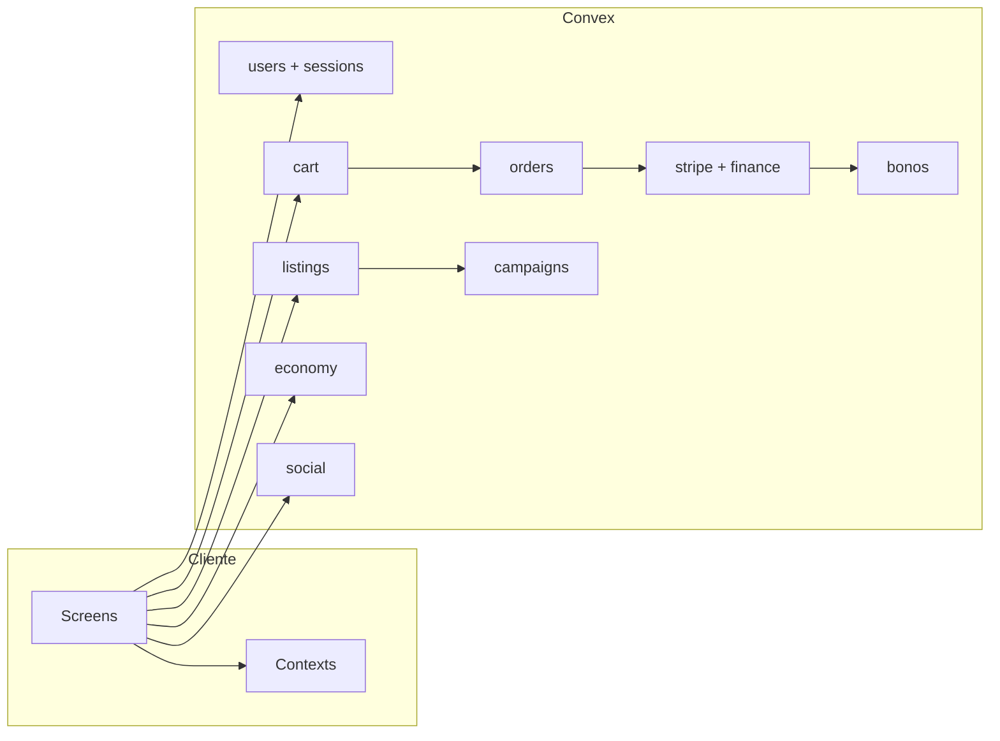

# Ramgos Mobile — Documentación de Arquitectura

> **Versión:** 1.0 · **Fecha:** 2026-07-15  
> **Repo:** `ramgos-mobile`  
> **Stack:** Expo (React Native) + Convex + Stripe (bi-modal test/live; el default es **live** cuando está configurado)  
> **Fuente de análisis:** código actual + Graphify (`graphify-out/`) + `PLAN_ESTRATEGICO_MAESTRO.md`

Este documento es el **mapa completo** del software: qué es, cómo está armado, cómo fluyen los datos, dónde está cada dominio y dónde leer más.

---

## Tabla de contenidos

1. [Qué es Ramgos](#1-qué-es-ramgos)
2. [Stack tecnológico](#2-stack-tecnológico)
3. [Arquitectura de alto nivel](#3-arquitectura-de-alto-nivel)
4. [Reglas de oro (no negociables)](#4-reglas-de-oro-no-negociables)
5. [Estructura del repositorio](#5-estructura-del-repositorio)
6. [Frontend — capas y providers](#6-frontend--capas-y-providers)
7. [Navegación y pantallas](#7-navegación-y-pantallas)
8. [Roles de usuario](#8-roles-de-usuario)
9. [Backend Convex](#9-backend-convex)
10. [Modelo de datos (schema)](#10-modelo-de-datos-schema)
11. [Dominios de negocio](#11-dominios-de-negocio)
12. [Auth y sesiones](#12-auth-y-sesiones)
13. [Pagos, escrow y finanzas](#13-pagos-escrow-y-finanzas)
14. [Bonos (QR)](#14-bonos-qr)
15. [Social, gamificación y puntos](#15-social-gamificación-y-puntos)
16. [Design system (UI)](#16-design-system-ui)
17. [Errores UX (cliente)](#17-errores-ux-cliente)
18. [Tooling, Graphify y calidad](#18-tooling-graphify-y-calidad)
19. [Variables de entorno](#19-variables-de-entorno)
20. [Índice de documentación del repo](#20-índice-de-documentación-del-repo)
21. [Estado del proyecto y riesgos](#21-estado-del-proyecto-y-riesgos)
22. [Cómo mantener este documento](#22-cómo-mantener-este-documento)

---

## 1. Qué es Ramgos

**Ramgos** es un marketplace + fintech + rewards + social, orientado a negocios locales, consumidores e influencers.

| Capacidad | Descripción corta |
|---|---|
| Marketplace | Productos, servicios, eventos, bonos |
| Escrow | Retención de pago hasta confirmar entrega / canje |
| Bonos | Vale digital: pagás X → crédito 2X en el negocio (QR) |
| Influencers | Campañas, whitelist, comisiones por referido |
| Wallet / payouts | Saldos, retiros, Stripe Connect |
| Points / games | Puntos, misiones, mascota, arcade |
| Social | Feed, follows, stories, DMs |
| Admin | Moderación, finanzas, ops |

**Pagos hoy:** modo **TEST / simulado** (`sk_test_`). No live hasta Bloque D del plan maestro.

---

## 2. Stack tecnológico

| Capa | Tecnología |
|---|---|
| App móvil / web | **Expo 56** · React 19 · React Native 0.85 · RN Web |
| Navegación | `@react-navigation/native` + native-stack |
| Backend BaaS | **Convex** (queries, mutations, actions, http, crons) |
| Pagos | **Stripe** (PaymentIntents + Connect) · `@stripe/*` |
| IAP | `react-native-iap` + `convex/iap*.ts` |
| Auth storage | AsyncStorage + sesiones server-side (`sessions`) |
| UI | Design tokens propios · Liquid Glass chrome · Lucide · Reanimated · Blur |
| Observabilidad | Sentry (`@sentry/react-native`) |
| Email | Resend (server) |
| Maps | `react-native-maps` / Leaflet (web) |
| Tests | Jest + Testing Library |
| Grafo de código | **Graphify** (`graphify-out/`) |

Scripts útiles (`package.json`):

```bash
npm start              # Expo
npm run web            # Web
npm run typecheck      # TypeScript estricto (tsconfig.check.json)
npm test               # Jest
npm run test:constitution
npm run db:seed        # npx convex run seed:seedE2E
```

---

## 3. Arquitectura de alto nivel

```
┌─────────────────────────────────────────────────────────────┐
│                     EXPO APP (cliente)                      │
│  Screens → Hooks/Contexts (UI state) → useQuery/Mutation    │
│  Chrome: MobileHeader / MobileNav (ChromeGlass)             │
└────────────────────────────┬────────────────────────────────┘
                             │ Convex React Client
                             ▼
┌─────────────────────────────────────────────────────────────┐
│                   CONVEX (única puerta)                     │
│  authHelpers.requireActor · schema · modules por dominio    │
│  http.ts (webhooks) · crons.ts · actions (Stripe/IAP)       │
└───────┬───────────────────┬───────────────────┬─────────────┘
        ▼                   ▼                   ▼
   Stripe TEST         Resend / Push         Stores IAP
   Connect             Notifications         Apple/Google
```

### Modelo mental correcto

```
❌ Contexto agrupa backend y “manda todo a Convex”
✅ Pantalla llama 1 función Convex (query/mutation/action)
✅ Contexto = estado local UI (tema, toast, cache de sesión, etc.)
```

---

## 4. Reglas de oro (no negociables)

1. El servidor **nunca confía** en `userId`, rol o montos del cliente.
2. Mutaciones sensibles → `requireActor(ctx, sessionToken)` (`convex/authHelpers.ts`).
3. Una fuente de verdad por dominio (carrito, órdenes, wallet, bonos).
4. Pagos: monto calculado en server → webhook / confirmación → recién ahí se materializa orden / emisión de bono.
5. Errores al usuario: mensaje limpio (`src/utils/errors.ts` + `ConvexError`), sin Request ID ni stacks.
6. Análisis de código: **Graphify primero** (`py -m graphify query "..."`), no escanear a ciegas.
7. Design: canvas neutro + violeta Ramgos solo en acentos; glass solo en chrome (header/nav/sheets).

---

## 5. Estructura del repositorio

```
ramgos-mobile/
├── App.tsx                 # Providers + NavigationContainer + Stack
├── index.js
├── app.json / eas.json     # Expo / EAS
├── package.json
├── DESIGN.md               # Design system v2
├── design-tokens.json
├── design-preview.html
├── PLAN_ESTRATEGICO_MAESTRO.md
├── DOCUMENTACION_ARQUITECTURA.md   ← este archivo
├── convex/                 # Backend
│   ├── schema.ts
│   ├── authHelpers.ts
│   ├── http.ts / crons.ts
│   ├── users.ts, cart.ts, listings.ts, orders.ts, ...
│   └── _generated/         # API tipada (no editar a mano)
├── src/
│   ├── screens/            # Pantallas por dominio
│   ├── components/         # UI + marketplace + social + games
│   ├── contexts/           # Estado cliente
│   ├── payments/           # Stripe UI / providers
│   ├── theme/              # tokens, brand
│   ├── hooks/
│   ├── services/
│   └── utils/              # glass, errors, gates, etc.
├── graphify-out/           # Grafo de conocimiento del código
├── scripts/
└── samples/                # Ej. Stripe Connect V2
```

---

## 6. Frontend — capas y providers

### 6.1 Árbol de providers (`App.tsx`)

Orden relevante (simplificado):

```
SafeAreaProvider
  ThemeProvider
    PaymentModeProvider
      ConvexProvider
        StripeKeyGate
          PaymentProvider
            ToastProvider
              ConfirmProvider
                CartProvider          ← envuelve Auth (E-017 / sessionTokenStore)
                  AuthProvider
                    NotificationsProvider
                      FavoritesProvider
                        EscrowProvider
                          PointsProvider
                            RewardsProvider
                              AppNavigator (+ EscrowSheet global)
```

### 6.2 Contextos (`src/contexts/`)

| Contexto | Responsabilidad |
|---|---|
| `AuthContext` | Login/registro, sesión, perfil, impersonate |
| `ThemeContext` | Light/dark |
| `ToastContext` | Toasts (sanitiza errores) |
| `ConfirmContext` | Diálogos de confirmación |
| `CartContext` | Carrito UI + sync Convex |
| `MarketplaceContext` | Catálogo / create listing bridge |
| `EscrowContext` | Sheet de escrow / disputas |
| `PointsContext` | Puntos, tiers, challenges (Convex `economy`) |
| `RewardsContext` | Pet, wheel, arcade, referrals locales |
| `FavoritesContext` | Favoritos |
| `NotificationsContext` | Inbox + prefs |
| `PaymentModeContext` | Keys Stripe test/live |
| `WalletContext` / `FintechContext` | Wallet / KYC bridge |
| `BusinessContext` | Dashboard negocio |
| `SocialContext` | Feed social |
| `ReferralContext` | Códigos de referido |

### 6.3 Capas UI

| Capa | Path | Notas |
|---|---|---|
| Tokens | `src/theme/tokens.ts`, `brand.ts` | Canvas neutro + primary `#7C3AED` |
| Glass | `src/utils/glass.ts`, `ChromeGlass.tsx` | Chrome = blur + frost |
| Primitives | `src/components/ui/*` | Button, Sheet, Card, Input… |
| Chrome | `MobileHeader`, `MobileNav` | Liquid Glass compartido |
| Domain UI | `components/marketplace`, `social`, `games`, `pet` | |

---

## 7. Navegación y pantallas

Stack principal en `App.tsx` (selección):

| Grupo | Screens |
|---|---|
| Auth / onboarding | Welcome, Login, Register, Verification, ForgotPassword, Onboarding, RoleSelection, BasicProfileSetup, Terms, Privacy |
| Core | Home, Marketplace, Social, Profile, Saved, History, Settings, Cart, Payment |
| Marketplace | ItemDetail, ProductDetail, CreateListing, MyListings, OrderDetail, MapExplorer |
| Bonos | BonusQR, BusinessScanner, BusinessQR |
| Negocio | BusinessDashboard, BusinessProfile, BusinessCreate, VerifyBusiness, BusinessDetail |
| Influencer | InfluencerDashboard, CampaignManager, Referrals, CommercialProfile |
| Escrow / disputes | Dispute, DisputeReason, DisputeChat |
| Wallet | Wallet, SellerWallet, Withdrawal, PaymentMethods |
| Admin | AdminDashboard, AdminFinance |
| Games / pet | Games, MiMascota |
| Soporte | HelpCenter, HelpArticleDetail, Support, About, Notifications, PrivacySecurity |
| Sistema | BannedUser, SubscriptionPlans, AnalyticsDashboard, ChangePassword, UserList |

**Nav inferior (`MobileNav`):** Home · Tienda · Social · Panel (si rol business/influencer/admin).

---

## 8. Roles de usuario

Definidos en schema / auth:

| Rol | Puede |
|---|---|
| `consumer` | Comprar, social, puntos, favoritos |
| `business` | Listings, bonos, scanner QR, campañas, Connect |
| `influencer` | Campañas, referidos, dashboards |
| `admin` | Ops, finanzas, moderación |
| `developer` | Tools / seed / impersonate (test) |

KYC: estados `unverified | pending | approved | rejected` (negocio y usuario).

---

## 9. Backend Convex

### 9.1 Módulos por archivo (`convex/`)

| Módulo | Dominio |
|---|---|
| `authHelpers.ts` | `requireActor`, roles, rate limit, sesiones |
| `passwordHelpers.ts` | Hash / verify passwords |
| `users.ts` | Auth, perfil, referidos, KYC bits |
| `schema.ts` | Todas las tablas |
| `cart.ts` | Carrito server-side |
| `listings.ts` | Catálogo / CRUD publicaciones |
| `orders.ts` | Órdenes + estados escrow |
| `disputes.ts` | Disputas + evidencia + chat |
| `stripe.ts` | PaymentIntents, webhooks handlers internos |
| `connect.ts` | Stripe Connect onboarding (`connectV2.ts` fue borrado) |
| `finance.ts` | Wallet ledger, payouts, withdrawals |
| `bonos.ts` | Emisión / canje QR / economics |
| `campaigns.ts` | Influencer ↔ business |
| `influencers.ts` | Whitelist |
| `economy.ts` | Gamificación, challenges, pet, coins |
| `points.ts` | Ledger de puntos |
| `social.ts` | Feed, follows, chats, stories |
| `notifications.ts` | Push / notifyUser |
| `events.ts` | Capacidad de eventos |
| `favorites.ts` | Favoritos |
| `reviews.ts` | Reviews |
| `subscriptions.ts` | Suscripciones Stripe |
| `iap.ts` / `iapActions.ts` | In-app purchases |
| `files.ts` | Upload URLs |
| `http.ts` | Webhooks HTTP |
| `crons.ts` | Auto-release escrow, reconciliación |
| `reconciliation.ts` | Flags / cursor Stripe |
| `admin.ts` / `adminQueries.ts` | Admin ops + stats |
| `developer.ts` / `seed*.ts` | Seeds y tools |
| `observability.ts` | Telemetría |

### 9.2 Tipos de funciones Convex

| Tipo | Uso |
|---|---|
| `query` | Lectura reactiva |
| `mutation` | Escritura transaccional |
| `action` / `internalAction` | I/O externo (Stripe API) |
| `httpAction` | Webhooks (`http.ts`) |
| `internalMutation` / `internalQuery` | Solo server-to-server |

Cliente tipado: `convex/_generated/api`.

---

## 10. Modelo de datos (schema)

Tablas principales en `convex/schema.ts`:

### Identidad y sesión
`users` · `sessions` · `audit_logs` · `rateLimits` · `userPreferences` · `savedAddresses`

### Marketplace
`listings` · `cart` · `orders` · `favorites` · `listingViews` · `searchHistory` · `reviews`

### Pagos / finanzas
`payments` · `paymentEvents` · `payouts` · `withdrawals` · `walletAccounts` · `walletLedger` · `stripeSubscriptions` · `reconciliationFlags` · `reconciliationCursor`

### Bonos / eventos / campañas
`bonoRedemptions` · `eventReservations` · `influencerCampaigns` · `influencerWhitelists`

### Economía / rewards
`economyState` · `pointsLedger` · `rewardsClaims`

### Social
`socialUsers` · `socialPosts` · `socialComments` · `socialLikes` · `socialFollows` · `socialStories` · `socialStoryViews` · `socialChats` · `socialMessages` · `socialSavedPosts` · `socialRetweets` · `socialHighlights`

### Otros
`disputeMessages` · `disputeEvidence` · `pushDeliveries` · `iapNotifications` · `iapReceipts` · `platformProducts`

### Campos clave de listings (bonos)
- `type`: `product | service | event | bono`
- `price` / `discountValue` / `discountType` (`fixed` para bonos)
- `validityDays` — vigencia del bono desde la compra (default **7**)
- `validUntil` — legacy / display absoluto
- `openPromotion` / `openCommissionRate` — influencers abiertos

### Campos clave de `bonoRedemptions`
- `bonoCode`, `status` (`issued | redeemed | expired | cancelled`)
- `paidAmount`, `creditTotal`, `creditRemaining`
- `usesTotal`, `usesRemaining`
- `validUntil`, `sellerId`, `ownerUserId`, `orderId` / `paymentId`

---

## 11. Dominios de negocio



---

## 12. Auth y sesiones

### Flujo

1. `users.login` / `register` → crea/valida user + emite `sessionToken` (tabla `sessions`).
2. Cliente guarda token (AsyncStorage / `sessionTokenStore`).
3. Cada mutación sensible manda `sessionToken`.
4. `requireActor` valida token, carga user, expone `AuthActor` (`idString`, `role`, …).
5. Logout → revoca sesión server-side.

### Helpers
- `requireActor` · `assertSelfOrAdmin` · `assertAdminOrDeveloper` · `checkRateLimit`
- Passwords: `passwordHelpers` (bcrypt)

### Pantallas
Login, Register (consumer/business/influencer), Verification, ForgotPassword, ChangePassword, BannedUser.

---

## 13. Pagos, escrow y finanzas

### Flujo checkout (TEST)

```
1. Usuario autenticado en Cart
2. gateCheckout / server valida sesión
3. stripe.createPaymentIntent (monto desde DB/cart)
4. Cliente confirma (Stripe test / mock)
5. Webhook o path mock → payment succeeded
6. Crea/actualiza orders + escrow held
7. Si item type=bono → internalIssueBonosForOrder / ForPayment
8. Compra de producto → puntos (economy) idempotente por paymentIntentId
```

### Escrow
- Estados reales (`convex/orders/_escrowStates.ts`): `held` → `release_pending` → `released`; `held`/`released` → `refund_pending` → `refunded`; más `disputed` y `frozen`. **No existe `release_scheduled`.**
- UI: `EscrowSheet` + `EscrowContext`
- Cron puede auto-liberar
- Bonos: al canjear QR se puede auto-completar orden (fulfillment en POS)

### Connect
- `connect.ts` — onboarding vendedor
- Payouts / withdrawals en `finance.ts`

Docs relacionadas: `PAYMENTS_SETUP.md`, `FINANCIAL_OPERATIONS_VALIDATION.md`, `_archive/MÓDULO_PAGOS_RESPALDO.md`.

---

## 14. Bonos (QR)

### Modelo económico estándar
- Cliente **paga $50** → recibe **$100** de crédito en el negocio (`discountType: fixed`).
- `validityDays` default **7** (configurable 1–365 por listing).
- Emisión: 1 código por unidad comprada.

### Ciclo de vida

```
Listing type=bono
   → Checkout / pago OK
   → bonoRedemptions status=issued (+ economics + validUntil)
   → Comprador: Mis compras → card bono → BonusQR (QR + código + crédito/usos)
   → Negocio: BusinessScanner / BusinessQR → redeemBono
   → status=redeemed · crédito/usos a 0 · escrow release best-effort
```

### UX errores de canje
- Server: `ConvexError("…")` con copy amigable.
- Cliente: `toUserMessage` / `toUserErrorTitle` (`src/utils/errors.ts`).
- Ejemplo: *“Este bono es de otro negocio. Pedile al cliente el QR correcto.”*

### Archivos clave
- Backend: `convex/bonos.ts`, seeds en `admin.ts` / `developer.ts`
- UI: `HistoryScreen`, `BonusQRScreen`, `BusinessScannerScreen`, `CreateListingScreen` (duración días)

---

## 15. Social, gamificación y puntos

### Social (`convex/social.ts`)
- **Entrada UI:** navbar `MobileNav` → sección `social` → `HomeScreen` monta `SocialScreen` (`isTabMode`).
- Handles en `socialUsers.username` (`@usuario`)
- Posts, likes, comments, follows, stories, DMs, highlights (Convex directo; no usar stubs de `SocialContext`)
- Creator Studio (`CreatorStudioModal`) con `CommerceLinker` / `attachedListingId`
- Checkout in-feed: `OneClickCheckoutSheet` + `simulateSocialCommercePayment`
- Perfiles desde el feed: `HybridProfile` (feed \| catálogo \| bonos); marketplace sigue usando `CommercialProfile`
- Lookup influencers por `@` (no email) en campañas / whitelist
- Doc de visión / gaps: `docs/ARQUITECTURA_SOCIAL_COMMERCE.md`

#### Seguidores en perfiles comerciales
- **Misma red social:** `CommercialProfile` / `HybridProfile` no tienen un contador aparte.
- Identidad: `sellerId` (users) = `socialFollows.followeeUserId`.
- Acumulador denormalizado: `socialUsers.followerCount`, actualizado en `follow` / `unfollow`.
- Al seguir un negocio sin perfil social previo, `ensureSocialUser` crea la fila (actor + followee) para que el contador crezca.
- Stats públicas (sin sesión): `getPublicSocialStats({ userId })` → `{ followerCount, followingCount, postCount, username }`.
- Lista detallada: `getFollowers` (requiere auth) vía pantalla `UserList`.
- UI: contador + tap “Seguidores” en `CommercialProfileScreen` / `HybridProfileScreen`; Seguir usa las mismas mutations `social.follow` / `unfollow`.

### Economía (`economy.ts` + `PointsContext` / `RewardsContext`)
- Puntos: **$1 cash ≈ 1 pt** en compras (con bonus de tier)
- Challenges: daily browse, weekly purchase, **quarterly mission**
- Pet virtual, arcade games, lucky wheel, game coins
- Referrals: código + puntos por registro / primera compra

### Games
- Contrato: `src/components/games/GAME_CONTRACT.md`
- Screens: `GamesScreen`, wrappers por juego

---

## 16. Design system (UI)

Fuente: `DESIGN.md` · `src/theme/tokens.ts` · `design-tokens.json` · `design-preview.html`

| Principio | Detalle |
|---|---|
| Dirección | Refined utilitarian marketplace |
| Canvas | `#FAFAFA` / `#09090B` (nunca wallpaper violeta) |
| Brand | `#7C3AED` en CTAs, nav activa, links |
| Glass | Solo chrome: header, bottom nav, sheets |
| Chrome | `ChromeGlass`: blur + frost ~72% + specular |
| Android | Frost más denso (`chromeDense`) porque el blur nativo es débil |
| Radius / Space | Escala 4…48 · radius sm→2xl |
| Touch | ≥ 44px |

Componentes chrome: `MobileHeader`, `MobileNav`, `src/components/ui/ChromeGlass.tsx`.

---

## 17. Errores UX (cliente)

| Pieza | Rol |
|---|---|
| `src/utils/errors.ts` | `toUserMessage`, `toUserErrorTitle` — limpia wrappers Convex |
| `ToastContext` | Sanitiza `error` / `warning` automáticamente |
| `ConvexError` en server | Payload limpio en `error.data` |

Nunca mostrar al usuario: `[CONVEX M(...)]`, Request ID, `at handler (../convex/...)`.

---

## 18. Tooling, Graphify y calidad

### Graphify (obligatorio para análisis)

```powershell
# Python 3.11 del proyecto
C:\Users\franc\AppData\Local\Programs\Python\Python311\python.exe -m graphify update .
C:\Users\franc\AppData\Local\Programs\Python\Python311\python.exe -m graphify query "tu pregunta"
C:\Users\franc\AppData\Local\Programs\Python\Python311\python.exe -m graphify path "A" "B"
C:\Users\franc\AppData\Local\Programs\Python\Python311\python.exe -m graphify explain "concepto"
```

Salida: `graphify-out/graph.json`, `GRAPH_REPORT.md`, `graph.html`.

### Calidad
- Typecheck: `npm run typecheck`
- Tests: `npm test` · constitution tests de rewards/points
- Convex deploy: `npx convex deploy`
- EAS: `eas.json` (Android/iOS release docs en repo)

### AI assistants
- `AGENTS.md` / `CLAUDE.md` → leer `convex/_generated/ai/guidelines.md` antes de tocar Convex
- Skills Convex en `.agents/skills/` y `.claude/skills/`

---

## 19. Variables de entorno

Ver `.env.example`:

| Variable | Uso |
|---|---|
| `EXPO_PUBLIC_CONVEX_URL` | URL del deployment Convex |
| `EXPO_PUBLIC_STRIPE_KEY_TEST` | Publishable key test |
| `EXPO_PUBLIC_STRIPE_KEY` / live | Live (solo post-go-live) |
| `EXPO_PUBLIC_SENTRY_DSN` | Crash reporting |
| `EXPO_PUBLIC_SUPPORT_WHATSAPP` | Soporte |

Secrets Stripe (`sk_…`, webhooks) viven en **Convex dashboard env**, no en el cliente.

---

## 20. Índice de documentación del repo

| Documento | Contenido |
|---|---|
| **Este archivo** | Arquitectura completa |
| `PLAN_ESTRATEGICO_MAESTRO.md` | Fases 1–8, checklists, bitácora, go-live |
| `DESIGN.md` | Design system v2 |
| `PAYMENTS_SETUP.md` | Setup Stripe |
| `FINANCIAL_OPERATIONS_VALIDATION.md` | Validación finanzas |
| `A_Z_Test_Report.md` | Bugs / hallazgos QA |
| `CONVEX_MIGRATION_PLAN.md` | Migración / estructura Convex |
| `LANZAMIENTO_GTM.md` | Go-to-market |
| `CLOSED_BETA_GO_LIVE_RUNBOOK.md` | Runbook beta |
| `CREDENTIALS_*` | Credenciales / handoff |
| `IOS_RELEASE_ENABLEMENT.md` / `RELEASE_ANDROID.md` / `PLAY_CONSOLE_*` | Release stores |
| `LEGAL_GAP_ANALYSIS.md` | Legal |
| `STORE_METADATA.md` | Metadata tiendas |
| `DEV_COMPLETENESS.md` | Cobertura dev |
| `PENDIENTES_FRONT_BACK.md` | Deuda abierta |
| `src/components/games/GAME_CONTRACT.md` | Contrato de juegos |
| `graphify-out/GRAPH_REPORT.md` | Grafo vivo del código |
| `convex/README.md` | Notas Convex |
| `_archive/` | Docs históricos (ej. pagos respaldo) |

---

## 21. Estado del proyecto y riesgos

### Estado (resumen del plan maestro)
- Fases 1–2 y 6 cerradas (auth/passwords/contexts).
- Fases 3–5 código listo; QA manual + push diferidos.
- Fase 7+ : cleanup App, ops admin, pentest, beta, launch NY.
- **Pagos:** TEST only.

### Riesgos históricos (ver A_Z / plan)
| ID | Tema |
|---|---|
| CART-03 | Guest → checkout (mitigar con gate + server) |
| ADSP-02 | Admin resolve disputes |
| AUSR-03 | Ban user |
| JEST-01 | Suites de test inestables |
| Pagos duplicados | Unificar camino Stripe TEST |

### Hubs Graphify (orientación)
`App.tsx` · `AuthContext` · `authHelpers` · `economy.ts` · `orders.ts` · `stripe.ts` · `EscrowSheet` · `bonos.ts` · `PointsContext` · `listings.ts`

---

## 22. Cómo mantener este documento

Actualizar cuando:

1. Cierre de fase del plan maestro.
2. Cambio arquitectónico (nuevo módulo Convex, nuevo provider, nuevo dominio).
3. Cambio de modelo de datos relevante en `schema.ts`.
4. Cambio de design system que afecte chrome / tokens.

Checklist:

```
1. py -m graphify update .
2. Revisar hubs en GRAPH_REPORT.md
3. Actualizar secciones 9–11 y 16 de este doc
4. Actualizar PLAN_ESTRATEGICO_MAESTRO.md §15/§16 si aplica
5. No marcar fases cerradas sin evidencia (comandos corridos)
```

---

## Apéndice A — Comandos rápidos

```powershell
# Dev
npm start
npm run web

# Backend
npx convex dev
npx convex deploy
npx convex run bonos:internalNormalizeBonoEconomics

# Grafo
& "C:\Users\franc\AppData\Local\Programs\Python\Python311\python.exe" -m graphify update .
& "C:\Users\franc\AppData\Local\Programs\Python\Python311\python.exe" -m graphify query "bonos stripe orders auth"

# Calidad
npm run typecheck
npm test
```

## Apéndice B — Glosario

| Término | Significado |
|---|---|
| Chrome | UI fija: topbar + bottom nav |
| Frost | Velo semitransparente sobre blur |
| Escrow | Dinero retenido hasta confirmación |
| Bono | Vale de crédito canjeable por QR |
| Actor | Usuario autenticado resuelto en server |
| Graphify | Grafo AST del codebase para navegación |
| ConvexError | Error tipado con payload limpio al cliente |

---

*Documento generado para el equipo Ramgos. Si hay conflicto entre este archivo y el código, gana el código + Graphify actualizado.*
